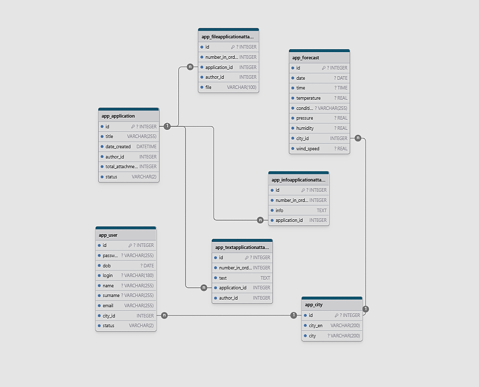
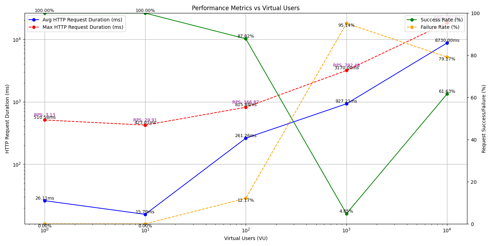
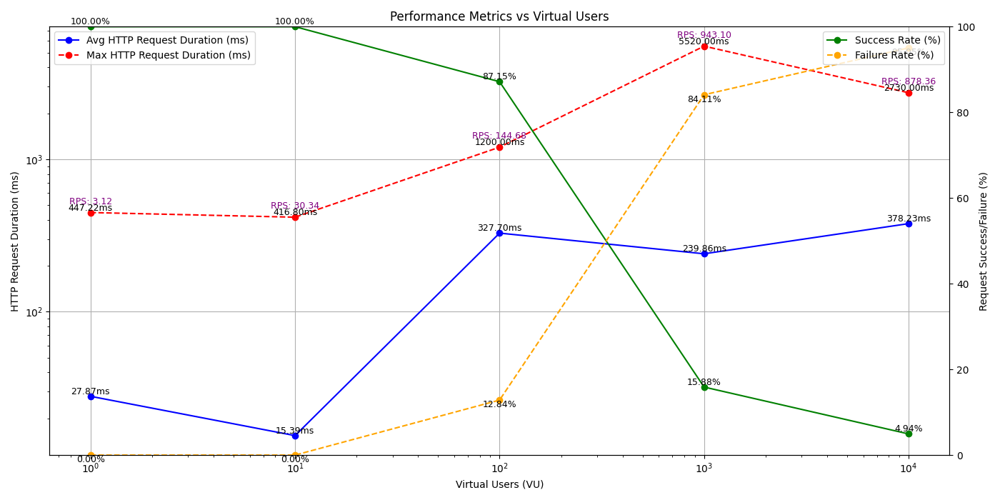
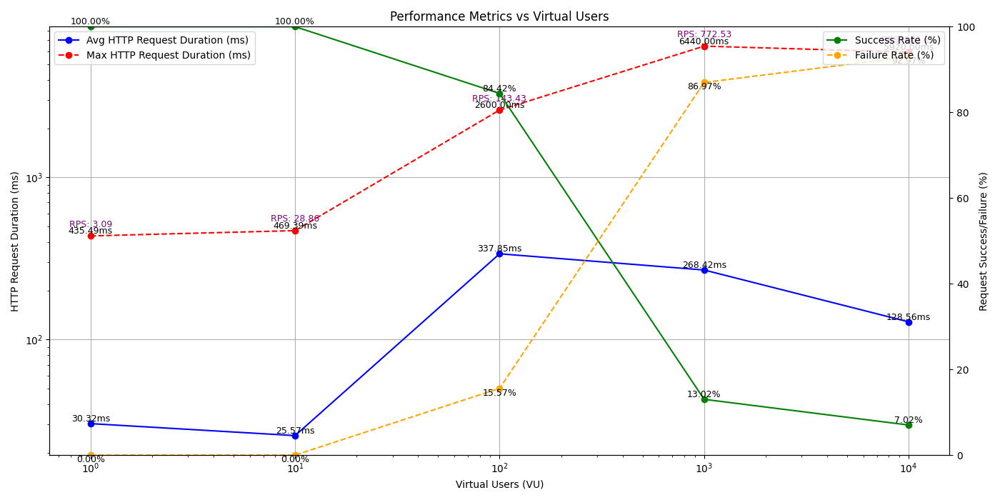

# WeatherApp API

## Описание проекта

**WeatherApp API** — это сайт предоставляющий прогнозы погоды в реальном времени.

Основные функции:

- Актуальные прогнозы погоды (температура, влажность, осадки и т.д.).
- Исторические данные о погоде.

На данный момент добавлены :

- Система регистрации и авторизации
- Возможность добавления заявок с прикреплением файлов
- Режим администратора
- Получение прогнозов
- Редактирование данных пользователя

В ближайшее время планируется :

- Расширение базы данных
- Обновление заявок
- Обновление визуального интерфейса

## Основные метрики

На графиках нише (см приложение ) приведены результаты тестирования производительности API с различным количеством виртуальных пользователей (VU). Ключевые выводы:

- Средняя длительность запросов (Avg HTTP Request Duration) увеличивается с ростом нагрузки, но остаётся в пределах допустимых значений до 100 виртуальных пользователей.
- При нагрузке выше 1000 VU заметно увеличивается количество неудачных запросов, что требует оптимизации.
- Пропускная способность (RPS) показывает, что API поддерживает до 861 запросов в секунду при 10 000 VU.

### Подробная информация про endpoints содержится в [файле расширения yaml ](openapi.yaml):

## Приложение

### Структура базы данных

### Графики стресс тестов endpoints отвечающих за прогнозы:

- ## Today

  

- ## Week
  
- ## Today24
  
